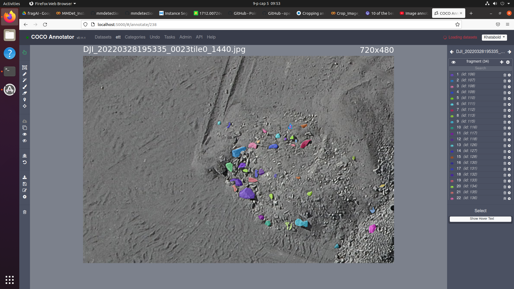

# fragmentationAI

This is the code base for fragmentation AI that uses instance segmentation approach for detecting and segmenting rocks/fragments to get each instance's size to analyze overall fragments distribution from 2D images.

### Model & algorithm:

For the instance segmentation task I used Transfer learning method which is fine-tuning (continue training) pretrained model by adapting in our custom segmentation problem/dataset. 

The pretrained model I used is `Mask-RCNN` that trained on ImageNet dataset and uses ResNet model as a backbone (Mask R-CNN was developed on top of Faster R-CNN, a Region-Based Convolutional Neural Network.) [Paper here](https://arxiv.org/abs/1703.06870). 


**This involved 2 stages of training:**
 1. First, fine-tune on large similar open-source dataset.
 2. Continue training model that came out from (1) on our small dataset.

### Dataset

1. The similar open-source dataset I have found is a dataset for detecting rocks from 2D artificial lunar images. [Link here](https://www.kaggle.com/datasets/romainpessia/artificial-lunar-rocky-landscape-dataset). This has about 9K images along with masks and bounding boxes.

2. Then we labeled and prepared around 2.6K segmentation instances that came from 35 different mining area's drone images. Data is in `./data/` folder in COCO format.


### Code

#### Training

 - Used colab for training on GPU. See `./examples/Fine-tuning-code.ipynb`

### Inference/predicting image
- mim install mmengine
- mim install "mmcv-full==1.6.2"
- mim install "mmdet==2.25.2"
- Download trained model file from [Google drive Link here](https://drive.google.com/file/d/1-N43BHk67HPc_uf-EeiPc_gahStrbCwb/view?usp=sharing)
- Install requirements by `pip install -r requirements.txt`. Python version I have used is `3.8.10`
- If you have a CUDA11 installed use this commands to install `mmdet`
    ```shell
        $pip install torch==1.9.0+cu111 torchvision==0.10.0+cu111 -f https://download.pytorch.org/whl/torch_stable.html
        
        $pip install mmcv-full -f https://download.openmmlab.com/mmcv/dist/cu111/torch1.9.0/index.html
        
        $rm -rf mmdetection
        
        $git clone https://github.com/open-mmlab/mmdetection.git
        
        $cd mmdetection

        $pip install -e .
    ```
- If you want CPU for prediction, use this commands to install `mmdet`
    ```shell
        $pip install torch==1.9.0 torchvision==0.10.0 -f https://download.pytorch.org/whl/torch_stable.html
        
        $pip install mmcv-full -f https://download.openmmlab.com/mmcv/dist/cpu/torch1.9.0/index.html
        
        $rm -rf mmdetection
        
        $git clone https://github.com/open-mmlab/mmdetection.git
        
        $cd mmdetection

        $pip install -e .
    ```
- See `predict.py`
